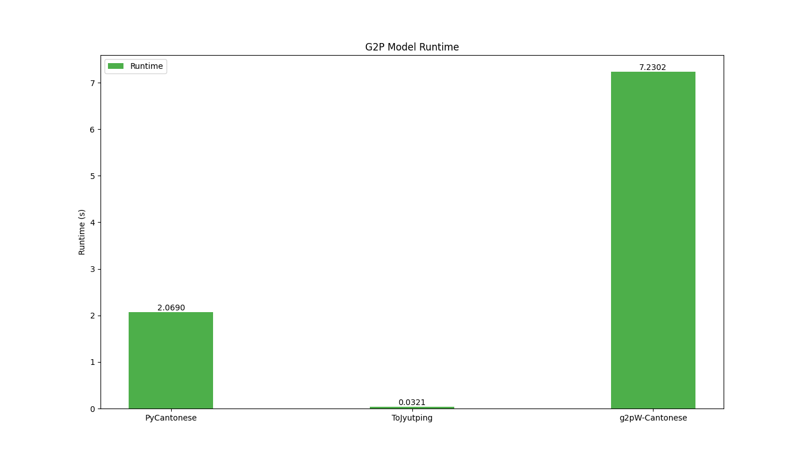

⚠️ Warning: The model `Naozumi0512/g2pW-canto-20241206-bert-base` used in this benchmark has been reported to have a [backdoor threat](https://protectai.com/insights/models/Naozumi0512/g2pW-canto-20241206-bert-base/2f435334357487f85d05429e2da1d6da93aafd2f/files?utm_source=huggingface). This is due to an old version of ONNX conversion. We have reported this to the model's author, who is currently working on a fix. Please use it at your own risk.

# Cantonese G2P Evaluation Benchmark

This project is a benchmark for evaluating Cantonese Grapheme-to-Phoneme (G2P) systems. The benchmark is based on the [Jyutping Romanization System](https://en.wikipedia.org/wiki/Jyutping). The data is obtained from [word.hk](https://words.hk/), 100 samples from [Dufu-Analysis](https://github.com/wingmingchan64/Dufu-Analysis) and 500 colloquial Chinese transcribed from [CanCLID/zoengjyutgaai_saamgwokjinji](CanCLID/zoengjyutgaai_saamgwokjinji).

The dataset includes character pairs along with their corresponding ground truth phonemes for G2P model evaluation. Each text file line contains a word, an underscore (_), and the target character for phoneme prediction. This format focuses on single-character phoneme prediction within words, making it suitable for assessing G2P models on specific characters.

## Metrics

The benchmark evaluates Cantonese G2P systems using two primary metrics:

### Accuracy

- **Definition**: The percentage of instances where the specified character within a word is correctly converted from graphemes to phonemes.
- **Purpose**: This metric measures how often the G2P model accurately predicts the phoneme for the target character in the context of the word.

### Phoneme Error Rate (PER)

- **Definition**: The proportion of phoneme components that are incorrectly predicted.
- **Calculation Details**:
  - **Syllable Decomposition**: Each Jyutping syllable is broken down into four components: **onset**, **nucleus**, **coda**, and **tone**.
  - **Hamming Distance**: PER is calculated by computing the Hamming distance between the predicted and ground truth quadruples (onset, nucleus, coda, tone).
    - For example, if the ground truth is `(s, a, i, 2)` and the prediction is `(s, a, m, 2)`, the Hamming distance is 1 (since only the coda differs).
  - **Multiple Labels Handling**: If multiple valid pronunciations (alternative labels) exist for a character, the PER is computed using the label that minimizes the Hamming distance to the prediction.
- **Purpose**: PER provides a fine-grained evaluation by identifying specific phoneme components where errors occur, offering insights into the model's phonological performance.

### Rationale for Metric Choices

#### Exclusion of Levenshtein Distance

Previously, the Levenshtein distance was considered for evaluating G2P performance but was found to be unsuitable for this benchmark due to:

1. **Dependency on Romanization System**:
   - The Levenshtein distance operates on the Jyutping romanization strings, which can bias the results based on spelling conventions rather than actual phonetic differences.
   - Different romanization systems might represent the same sounds with different letters or letter combinations, affecting the distance calculation.

2. **Positional Pronunciation Variations**:
   - In Cantonese, certain letters represent sounds that change depending on their position within a syllable.
     - **Example**: The letters **p**, **t**, and **k** are aspirated when they appear at the beginning (**onset**) of a syllable but are unreleased when they appear at the end (**coda**).
   - Levenshtein distance does not account for these positional differences, potentially overestimating errors when letters are the same but their pronunciations differ due to their positions.

By using **Accuracy** and **Phoneme Error Rate (PER)** based on phonetic components, the benchmark provides a more accurate and meaningful evaluation of G2P systems that reflects true phonological performance rather than orthographic or romanization discrepancies.

## Usage

### Pre-requisites

```bash
# pull submodules
git submodule update --init --recursive
# install dependencies
pip install -r requirements.txt
# install g2pW-Cantonese dependencies
pip install -r g2pW-Cantonese/requirements.txt
```

### Run the Benchmark

```bash
python run.py
```

## Leaderboard


## Runtime Comparison



## How to Submit

To submit your G2P system, please subclass the `G2PModel` class in `models` and implement the `_predict` method. Then, add your model to the `models` list in `run.py`. Finally, run `run.py` to generate the results.
